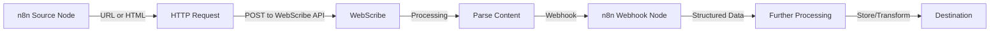

# WebScribe

WebScribe transforms complex web pages into clean, structured Markdown while preserving essential metadata. Initially optimized for scientific articles, WebScribe can be extended to handle various content types. The application provides both a REST API and command-line tools for parsing HTML content.

## Features

- 🔄 **Intelligent Content Extraction**: Automatically identifies and extracts the main content from webpages
- 📝 **Markdown Conversion**: Transforms HTML to clean, readable Markdown
- 📊 **Metadata Extraction**: Retrieves title, authors, publication date, and other metadata when available
- 🪝 **Webhook Integration**: Sends parsed content to any configured endpoint (perfect for n8n workflows)
- 🔒 **Payload Signing**: Secures webhook payloads with HMAC signatures
- ⚡ **FastAPI Backend**: High-performance REST API with automatic documentation
- 🧰 **CLI Tools**: Parse URLs directly from the command line

## Quick Start

### Prerequisites

- Python 3.8+
- `lsof` command-line utility (for process management)

### Installation

1. Clone the repository:
   ```bash
   git clone https://github.com/jaywalked78/WebScribe.git
   cd WebScribe
   ```

2. Create a configuration file:
   ```bash
   cp .env.example .env
   ```

3. Edit the `.env` file to customize settings (especially webhook URL if using with n8n)

4. Run the server:
   ```bash
   ./run_server.sh
   ```

The API will be available at http://localhost:8877 (or your configured host/port).

## Configuration

Configuration is managed through environment variables, which can be set in the `.env` file:

| Variable | Description | Default |
|----------|-------------|---------|
| HOST | API server host | 0.0.0.0 |
| PORT | API server port | 8000 |
| LOG_LEVEL | Logging verbosity (DEBUG, INFO, etc.) | INFO |
| WEBHOOK_URL | URL to send parsed content to | None |
| WEBHOOK_SECRET | Secret key for signing webhook payloads | None |
| MAX_CONTENT_SIZE | Maximum content size in bytes | 10MB |
| TIMEOUT_SECONDS | Request timeout in seconds | 30 |
| DEBUG | Enable debug mode | False |
| CORS_ALLOW_ORIGINS | Allowed CORS origins | * |

## Usage

### REST API

The API provides two main endpoints:

- **POST** `/api/v1/parse`: Parse raw HTML content
- **POST** `/api/v1/parse-url`: Fetch and parse a URL

Example using curl:

```bash
curl -X POST "http://localhost:8877/api/v1/parse-url" \
  -H "Content-Type: application/json" \
  -d '{"url": "https://example.com/article"}'
```

### Command Line

Parse a URL and output the Markdown:

```bash
./parse_url.sh https://example.com/article
```

Parse a URL and save to a file:

```bash
./parse_url.sh https://example.com/article output.md
```

Run a test parse with webhook integration:

```bash
./run_test_parse.sh https://pmc.ncbi.nlm.nih.gov/articles/PMC8998800/
```

## Integration with n8n

WebScribe works seamlessly with n8n for content extraction and processing workflows.

### Workflow Diagram



### Setting Up the n8n Workflow

1. **Source Node**: Use any n8n node that provides URLs or HTML content (HTTP Request, RSS Feed, etc.)
2. **HTTP Request Node**: 
   - Method: POST
   - URL: http://your-webscribe-host:port/api/v1/parse-url
   - Body: `{"url": "{{$node['Previous_Node'].json.url}}"}`
3. **Webhook Node**: 
   - Configure a webhook in n8n to receive the parsed content
   - Set the webhook URL in WebScribe's `.env` file: `WEBHOOK_URL=http://your-n8n-host:port/webhook-path`
4. **Processing Nodes**: Add nodes to process the structured data (Markdown content and metadata)

## API Documentation

When the server is running, visit http://localhost:8877/docs for interactive API documentation.

## Advanced Usage

### Webhook Payload Structure

The webhook payload contains:

```json
{
  "id": "unique-uuid",
  "timestamp": "ISO-formatted-date",
  "source_url": "original-url",
  "status": "success",
  "markdown": "converted-content",
  "metadata": {
    "title": "page-title",
    "authors": ["author1", "author2"],
    "date": "publication-date",
    "keywords": ["keyword1", "keyword2"]
  },
  "processing_time_ms": 1234
}
```

### Security

For secure webhook integrations, set `WEBHOOK_SECRET` in your `.env` file. The webhook will include an `X-Signature` header with an HMAC-SHA256 signature of the payload for verification.

## Contributing

Contributions are welcome! Please feel free to submit a Pull Request.

## License

This project is licensed under the MIT License - see the LICENSE file for details. 