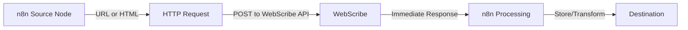

# WebScribe

WebScribe transforms complex web pages into clean, structured Markdown while preserving essential metadata. Initially optimized for scientific articles, WebScribe can be extended to handle various content types. The application provides both a REST API and command-line tools for parsing HTML content.

## Features

- 🔄 **Intelligent Content Extraction**: Automatically identifies and extracts the main content from webpages
- 📝 **Markdown Conversion**: Transforms HTML to clean, readable Markdown
- 📊 **Metadata Extraction**: Retrieves title, authors, publication date, and other metadata when available
- ⚡ **Direct n8n Integration**: Returns parsed content directly to n8n for immediate processing
- 🧰 **CLI Tools**: Parse URLs directly from the command line
- 🚀 **Optional Integrations**:
  - 🪝 **Webhook Support**: Can send parsed content to configured endpoints
  - 📋 **Airtable Syncing**: Can directly sync with Airtable records
  - 🔒 **Payload Signing**: Secures webhook payloads with HMAC signatures
- 🔥 **FastAPI Backend**: High-performance REST API with automatic documentation

## Quick Start

### Prerequisites

- Python 3.8+
- `lsof` command-line utility (for process management)

### Installation

1. Clone the repository:
   ```bash
   git clone https://github.com/jaywalked78/WebScribe.git
   cd WebScribe
   ```

2. Create a configuration file:
   ```bash
   cp .env.example .env
   ```

3. Edit the `.env` file to customize settings

4. Run the server:
   ```bash
   ./run_server.sh
   ```

The API will be available at http://localhost:8877 (or your configured host/port).

## Configuration

Configuration is managed through environment variables, which can be set in the `.env` file:

| Variable | Description | Default |
|----------|-------------|---------|
| HOST | API server host | 0.0.0.0 |
| PORT | API server port | 8000 |
| LOG_LEVEL | Logging verbosity (DEBUG, INFO, etc.) | INFO |
| WEBHOOK_URL | URL to send parsed content to (optional) | None |
| WEBHOOK_SECRET | Secret key for signing webhook payloads (optional) | None |
| AIRTABLE_PERSONAL_ACCESS_TOKEN | Airtable personal access token (optional) | None |
| AIRTABLE_BASE_ID | Airtable base ID (optional) | None |
| AIRTABLE_TABLE_NAME | Airtable table name (optional) | None |
| MAX_CONTENT_SIZE | Maximum content size in bytes | 10MB |
| TIMEOUT_SECONDS | Request timeout in seconds | 30 |
| DEBUG | Enable debug mode | False |
| CORS_ALLOW_ORIGINS | Allowed CORS origins | * |

## Usage

### REST API

The API provides two main endpoints:

- **POST** `/api/v1/parse`: Parse raw HTML content
- **POST** `/api/v1/parse-url`: Fetch and parse a URL

Example using curl:

```bash
curl -X POST "http://localhost:8877/api/v1/parse-url" \
  -H "Content-Type: application/json" \
  -d '{"url": "https://example.com/article"}'
```

### Command Line

Parse a URL and output the Markdown:

```bash
./parse_url.sh https://example.com/article
```

Parse a URL and save to a file:

```bash
./parse_url.sh https://example.com/article output.md
```

Run a test parse:

```bash
./run_test_parse.sh https://pmc.ncbi.nlm.nih.gov/articles/PMC8998800/
```

## Integration with n8n

WebScribe is designed to integrate seamlessly with n8n for powerful content extraction and processing workflows.

### Direct Integration (Recommended)

The most efficient way to use WebScribe with n8n is via direct API integration:



### Setting Up the n8n Workflow

1. **Source Node**: Use any n8n node that provides URLs or HTML content (HTTP Request, RSS Feed, etc.)
2. **HTTP Request Node**: 
   - Method: POST
   - URL: http://your-webscribe-host:port/api/v1/parse-url
   - Body: `{"url": "{{$node['Previous_Node'].json.url}}", "record_id": "optional-record-id-for-tracking"}`
3. **Processing Nodes**: Process the returned markdown and metadata directly in n8n

### Benefits of Direct Integration

- **Immediate Data Access**: Get parsed content and metadata instantly in your n8n workflow
- **Simpler Architecture**: No need to set up webhooks or additional connections
- **Reliable Processing**: Avoid potential webhook delivery issues or timeouts
- **Full Control**: Process, transform, and store data directly within n8n

## API Documentation

When the server is running, visit http://localhost:8877/docs for interactive API documentation.

## Advanced Usage

### Optional Airtable Integration

WebScribe includes built-in Airtable integration capabilities (disabled by default):

1. Set up your Airtable base with a table that includes these fields (field names must match):
   - URL (URL field)
   - Title (Text field)
   - Authors (Text field)
   - PublicationDate (Date field)
   - Journal (Text field)
   - DOI (Text field)
   - Keywords (Text field)
   - Abstract (Long text field)
   - Markdown (Long text field)
   - ParseID (Text field)
   - ProcessingTimeMs (Number field)

2. Configure your environment variables:
   ```
   AIRTABLE_PERSONAL_ACCESS_TOKEN=your_token
   AIRTABLE_BASE_ID=your_base_id
   AIRTABLE_TABLE_NAME=your_table_name
   ```

3. Uncomment the Airtable integration code in `app/main.py` to enable this feature

### Optional Webhook Integration

For webhook-based integration (disabled by default):

1. Configure your webhook destination endpoint
2. Set the webhook URL in your `.env` file:
   ```
   WEBHOOK_URL=http://your-destination-endpoint.com/webhook-path
   WEBHOOK_SECRET=your_secret_key
   ```
3. Uncomment the webhook integration code in `app/main.py` to enable this feature

### Response Payload Structure

The API response contains:

```json
{
  "id": "unique-uuid",
  "timestamp": "ISO-formatted-date",
  "source_url": "original-url",
  "status": "success",
  "markdown": "converted-content",
  "metadata": {
    "title": "page-title",
    "authors": ["author1", "author2"],
    "date": "publication-date",
    "keywords": ["keyword1", "keyword2"]
  },
  "processing_time_ms": 1234,
  "record_id": "optional-tracking-id"
}
```

## Contributing

Contributions are welcome! Please feel free to submit a Pull Request.

## License

This project is licensed under the MIT License - see the LICENSE file for details. 